# Django - 1

[TOC]

## 목표

장고의 MTV 패턴을 알아보고, 기본적인 장고 프로젝트를 생성해 봅니다. 그리고 DTL을 사용해 볼 것입니다. HTTP의 form 을 사용해 GET 방식으로 데이터를 주고받은 뒤, app에 url을 mapping하도록 나누어 유지보수를 좋게 하는 리팩토링까지 진행해 보겠습니다.

## MTV framework, django

장고는 MVC를 기반으로 한 프레임워크입니다. 하지만 장고에서는 같은 개념을 `MTV (Model - Template - View)` 라고 부릅니다.

데이터(model), UI(View), 데이터 처리 로직(Controller)로 구분되는 MVC와 기본적으로 동일하며, 용어만 다르다고 보시면 되겠습니다.

### Model

모델은 DB에 저장되는 데이터를 의미합니다. 모델은 `Class`로 정의되며, 하나의 클래스가 하나의 DB Table입니다.

DB를 조작하려면 SQL을 알아야 하지만, 장고는 ORM(Object Relational Mapping) 기능을 지원하기 때문에 매우 간단합니다.

### Template

유저에게 보여지는 화면 (UI)을 의미합니다. 장고는 뷰에서 로직을 처리한 후 html 파일을 context와 함께 렌더링하는데 이 때의 html 파일을 템플릿이라 칭합니다.

장고는 자체적인 Django Template 문법을 지원하며 이 문법 덕분에 html 파일 내에서 context로 받은 데이터를 활용할 수 있습니다.

### View

요청에 따라 적절한 로직을 수행하며, `render` 하거나 `return` 합니다. 장고를 백엔드로 사용할 경우에는 return이 대다수가 되겠죠.

### Flow


흐름을 정리해 보겠습니다.

1. 유저가 특정 url을 request
2. urlConf를 통해 해당 url과 Mapping된 View 호출
3. 호출된 View는 요청에 따라 적절한 로직을 수행하며 필요할 경우 CRUD를 지시
4. 모델은 ORM을 통해 DB와 소통하며 CRUD 수행
5. View는 지정된 Template을 render하거나, 요청받은 값을 return

## 첫 프로젝트 생성

```shell
pip install Django===3.2.12 (LTS로 설치)
## 가상환경 설정은 나중에

## 장고 프로젝트 생성
django-admin startproject firstpjt
python manage.py migrate # 맨 첫 구동 시에 에러가 난다면.
python manage.py runserver # 서버 구동 확인
```

### firstpjt == package
- `__init__.py`: 다른 파일들이 하나의 패키지임을 알 수 있게 해줍니다.
- asgi.py django 3에서 새로 생긴 파일. 비동기적인 웹 서버를 연동할 때 사용하는 것이고, 딱히 쓰지 않을 거에요.
- settings는 만든 어플리케이션을 등록하고, 미디어/스태틱 파일의 위치 등 각종 세팅값이 있고 많이 건드리는 부분이에요.
- urls는 site url의 내부 연결을 지정해 주는 곳입니다.
- wsgi는 배포할 때만 잠깐 사용하는 곳이고, 지금 당장은 생각하지 않으셔도 됩니다.

#### trailing Comma

django에서는 구조적으로 trailing comma를 추천합니다.

#### Internationalization

```
LANGUAGE_CODE를 `ko-kr`로 바꾸면 한국 locale을 볼 수 있습니다.

TIME_ZONE을 'Asia/Seoul'로 바꾸면 시간대도 바꿀 수 있습니다.
```

### 새로운 application 생성

앱 생성을 할 때는 이것을 명심하세요.

1. app 이름은 복수형
2. app 생성(startapp) 하고 난 후에(!!!), settings에 등록

```
python manage.py startapp articles
```

새로운 어플리케이션을 생성했습니다. articles의 파일을 살펴볼게요.

- admin.py: 관리자 페이지를 커스텀하는 파일입니다.
  - /admin 쿼리로 관리자 페이지에 접속해 봅시다. 장고는 자체적으로 관리자 페이지를 지원하는데, 이 기능이 매우매우 강력합니다.
  - `python manage.py createsuperuser` 명령어를 통해 admin 계정을 생성할 수 있습니다.

- apps.py: 건드리지 않을겁니다.
- models.py: MTV 패턴 중, M의 역할을 하는 부분입니다.
- test.py: 테스트 코드를 작성하는 곳입니다. 따로 다루지 않을게요.
- views.py: MTV 중, V(View, 중간 관리자) 역할을 하는 파일입니다.

흐름으로 기억하시면 됩니다. 이제부터는 url, view, template 순서대로 계속 작업할 거에요.

### application 등록

어플리케이션을 추가했으면 이 앱을 메인에서 인식할 수 있도록 등록해 줘야 합니다.
root의 `settings.py`의 INSTALLED_APPS에 추가해 주기만 하면 됩니다.

이때 아래의 암묵적인 order를 따져 주는 것이 프로젝트가 커졌을 때를 대비하기 좋습니다.

1. local apps
2. 3rd-part apps
3. django apps(기본 앱)

### application url mapping

이제 articles 앱의 파일을 사용하기 위해서는 `./urls`에 url에도 추가해줘야 합니다. 사용자의 요청을 articles 앱이 응답할 수 있도록 path를 돌려주는 거죠. 어떤 view 함수를 실행시킬 거냐? 이겁니다.

그럼 index라는 url로 들어오면 main page를 렌더링하는 함수를 작성해 보겠습니다. articles의 views에 index() 함수를 작성해 보겠습니다. 그리고 ./urls에 articles의 view를 import해 옵니다.

다음으로는 어플리케이션에 `templates` 폴더를 꼭! 생성해야 합니다. 그리고 index.html 파일을 만듭니다. 그러면 이제 `/index`로 접속할 경우 잘 보이게 됩니다.

그러면 여기까지 django의 한 사이클을 돌아 보았습니다. 클라이언트 입장에서 request를 보내고, 이것을 새로 만든 어플리케이션에 템플릿을 보여주도록 View 함수를 조작했습니다.

그러면 이제 개발을 쉽게 해주는 django의 built-in system, django template을 사용하기 위한 DTL에 대해 알아보고 사용해 보도록 하겠습니다.

## Django Template Language (DTL)

- 조건, 반복, 변수 치환, 필터 등의 기능을 제공
- 단순히 Python이 HTML에 포함 된 것이 아니며, 프로그래밍 로직이 아니라 프레젠테이션을 표현하기 위한 것
- 파이썬처럼 일부 프로그래밍 구조를 사용하지만, Python 코드는 아님

### Variables

`{{ variable }}`

- render()를 사용하여 views.py에서 정의한 변수를 template 파일로 넘겨 사용하는 것.
- 변수명은  영어, 숫자와 밑줄(_)로 구성될 수 있으나 밑줄로는 시작할 수 없음.
  - 공백이나 구두점도 불가
- dot(.) 를 사용하여 변수 속성에 접근할 수 있음
- render()의 세번째 인자로 {'key': 'value'} 형태로 넘겨주며, key가 template에서 사용할 수 있는 변수명이 된다.

**실습**

그럼 variables부터 실습해 보겠습니다. url-view-template이라고 했으니, url로 가겠습니다.

variables url을 만들어 주고(url), view로 이동해서 함수를 만들고(view), 해당 앱의 templates 폴더에 variables.html을 생성해 주겠습니다.(template).

### Filters

`{{ variable|filter }}`

- 표시할 변수를 수정할 때 사용
  - 예시) `{{ name|lower}}`
  - name 변수를 모두 소문자로 출력
- 60개의 filter 제공
- chained, 필터끼리 연결될 수 있으며 일부 필터는 인자를 받기도 함
- `{{ variable|truncatewords:30 }}`: 30자 까지만 짤라서 출력하겠다.
- {{ plan.date | date:'Y-m-d' }}

### Tags

- 
- 출력 텍스트를 만들거나 반복 또는 논리를 수행하여 제어 흐름을 만드는 등 변수보다 복잡한 일들을 수행
- 일부 태그는 시작과 종료 태그가 필요
  -  ... 
- 약 24개의 built-in template tags를 제공

**실습**

filters.html에 for 태그를 사용해 보겠습니다.

### Comments

```python
{# lorem ipsum #}
```

- django template에서 줄의 주석을 표현하기 위해 사용 
- 한 줄 주석에만 사용할 수 있음
- 여러 줄 주석은   사이에 입력

### Template inheritance

- 템플릿 상속은 기본적으로 코드의 재사용성에 초점을 맞춤

모든 페이지에 어떠한 CDN을 가져와서 사용한다고 생각하면, 당연히 Override가 필요합니다. DT은 이 기능도 제공해 줍니다.

#### Template inheritance - tags



- 자식 템플릿이 부모 템플릿을 확장한다는 것을 알림
- 반드시 템플릿 최상단에 위치해야 함



- 하위 템플릿에서 재지정(override) 할 수 있는 블록을 정의
- 즉, 하위 템플릿이 채울 수 있는 공간

**실습**

bootstrap 네비게이션 바를 기본적으로 가지는 부모 템플릿을 생성해 볼까요?

~/templates/base.html 을 생성합니다. 그리고 기존의 index.html의 내용 중 필요한 부분이 어딘지 체크해 보겠습니다.

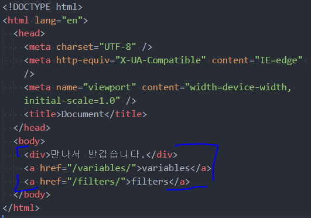

네모 친 부분만 필요하겠죠?

저 부분을 제외한 나머지는 삭제하고, 아까 부모 템플릿을 extends 해 오면 되겠습니다. 굉장히 익숙하죠? 그리고 block 안에 필요한 부분만 삽입합니다.

#### 이렇게 하면 에러가 납니다. templates path를 추가해야 하거든요!

장고가 templates를 기억한다고는 했지만, 정확히는 app_name/templates/ 까지만 템플릿 경로로 인식합니다. 즉, firstpjt/templates는 장고가 인식하지 못하는 경로라는 것이죠.

이 값을 인식하게 하기 위해서는 app에만 추가해 주어야 할까요? 댓츠 노우 노우. settings에 기본 템플릿 경로를 추가해 주겠습니다.

BASE_DIR은 프로젝트의 root path를 가져오도록 기본적으로 설정되어 있습니다. 아래와 같이 되어 있기 때문에, 운영체제에 관계 없이 잘 가져올 수 있습니다.

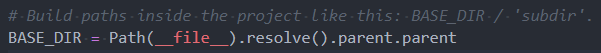

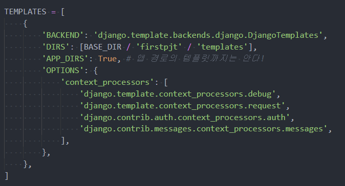

### Django template system (feat. django 설계 철학)

- 표현과 로직(view)을 분리
  - 템플릿 시스템은 표현을 제어하는 도구이자 표현에 관련된 로직일 뿐
  - 즉, 템플릿 시스템은 이러한 기본 목표를 넘어서는 기능을 지원하지 말아야 함
- 중복 배제
  - 대다수의 동적 웹사이트는 공통 header, footer, navbar 같은 공통 디자인을 가진다.
  - django 템플릿 시스템은 이러한 요소를 한 곳에 저장하기 쉽게 하여 중복 코드를 없애야 한다.
  - 이것이 템플릿 상속의 기초가 되는 철학이다.

### Data Throw & Catch (HTTP form - GET)

다음으로 이번에는 데이터를 주고 받아 보도록 하겠습니다. 
데이터를 주고받기 위해서는 `데이터를 보낼 view`, `데이터를 받을 view` 이렇게 두개가 필요합니다.

throw - catch의 url을 추가하고, view를 추가합니다. 

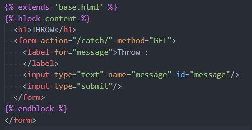

throw에 `form action='/catch'`을 설정해 주면, 잘 받는 모습을 볼 수 있습니다.

### URL
django에서 url을 더 깔끔하게 사용하는 방식으로 바꾸어 볼게요.

#### App URL mapping - 각 app마다 url을 나누어서 관리하기

지금 url은 root의 urls.py 하나에서 모든 url을 관리하고 있습니다. 유지보수하기 끔찍하겠죠? 이제는 각 app에서 url을 관리하도록 하겠습니다.

```shell
# 새로운 앱 생성 후, 앱 등록
python manage.py startapp pages
```

그 다음, root의 url에서 article에서 사용하던 모든 path를 article/urls로 싹 다 옮겨옵니다.
그리고 root의 url은 `include`를 import해 와서, 각각의 앱으로 path를 연결해 줍니다.
그럼 기존에는 아래와 같던 조잡한 url에서,

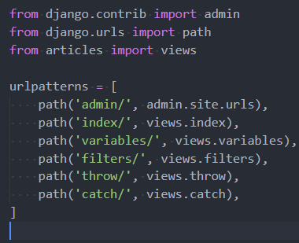

아래와 같이 깔끔하게 바뀌게 됩니다.
이제 articles/로 클라이언트의 리퀘스트가 들어오면 장고 서버는 articles에게 처리하라고 떠넘기게 됩니다. Proxy와 같아요.

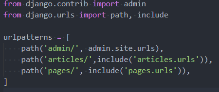

유지보수가 간편해졌죠?

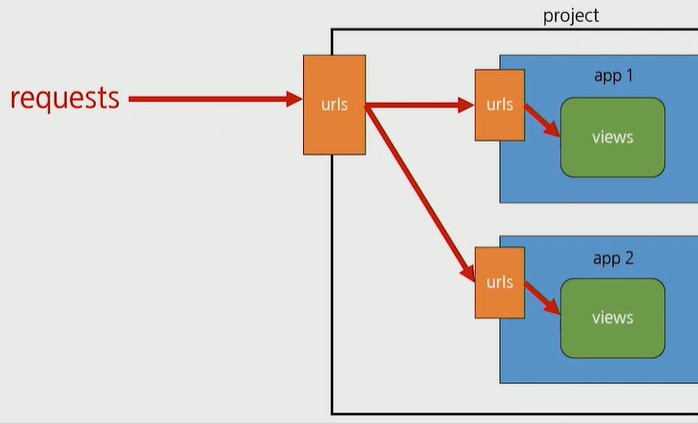

그런데, 이렇게 바꾸면 기존에 경로가`/filters`와 같이 url이 직접 작성되어 있던 앵커 태그가 오류가 나게 됩니다. 해결을 위해 `url tag`를 사용해 볼게요. 

#### Naming URL patterns

- 이제는 링크에 url을 직접 작성하는 것이 아니라 path() 함수의 name 인자를 정의해서 사용
- url 설정에 정의된 특정한 경로들의 의존성 제거 가능. name만 사용하면 끝!

path에 name을 설정해 주겠습니다.

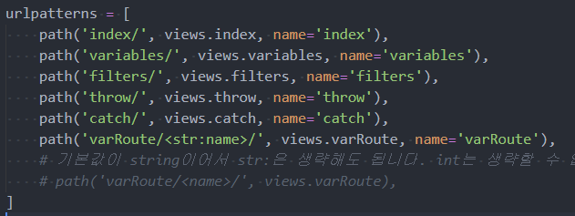

그럼 기존에 이랬던 것들을,

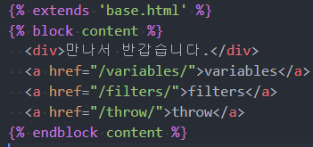

이렇게 바꿔서 사용하게 됩니다.

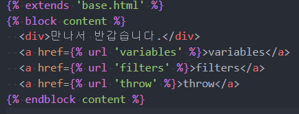

### Variable routing

주소 자체를 변수처럼 사용해서 동적으로 주소를 만들어 보겠습니다. 주로 프로필이나, 게시글의 상세 페이지에 들어갈 때에 흔히 사용되는 방법이에요.

`varRoute`라는 url, view, template을 추가해 줍니다. 이 경우에는 두 번째 인자로 name이라는 query를 받습니다. 이걸 고스란히 context로 넘겨 주겠습니다.

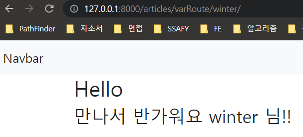

잘 나오네요!
