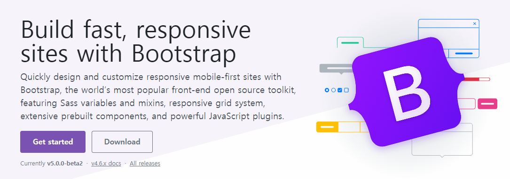
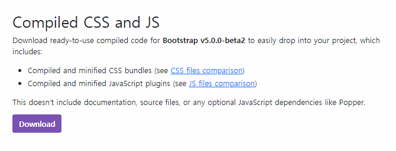

# 06_HomeWork

Related project path : ssafy_mygit/django_webex/0317_03_django_form

### 1. Compiled Bootstrap CSS, JS 파일을 다운로드 받아 Django 프로젝트에 Static 파일로 추가하시오.





### 방법 1 파일 다운로드 후 추가

bootstrap 파일을 다운로드 받은 뒤, static 폴더 안에 넣는다.

이후, settings.py에서 static 파일의 경로를 추가한다.

#### 1 프로젝트 구조

만일 프로젝트명이 crud라면 아래와 같은 프로젝트 구조로 구성한다.

```
crud/
	static/
		bootstrap/
			css/
			fonts/
			js/
```

#### 2-1 static 파일 경로 설정

이렇게 되었다면, settings.py에서 static 파일 경로를 설정하면 된다.

```
STATICFILES_DIRS = [
    BASE_DIR / 'crud' / 'static'
]
```

#### 2-2 static 파일 경로 설정

`static` 폴더의 경로 변수를 만든 뒤, 그것을 추가할 수도 있다.

```
STATIC_DIR = os.path.join(BASE_DIR, 'crud', 'static')
STATICFILES_DIRS = [
    STATIC_DIR,
]
```

**STATICSFILES_DIRS를 지정하지 않았는데도 css가 반영된 경우** 

memory cache에서 css를 가져오기 때문이다. 캐시를 삭제하게 되면 css가 정상적으로 없어진다.


#### 3 CSS 파일 적용

**base.html**

```html


  <link rel="stylesheet" href="">
```

static을 불러온 뒤, link 태그에서 static 경로로 bootstrap css를 불러올 수 있다.

### 방법 2 Django에서 제공하는 pip package 사용

bootstrap을 django의 3rd-party application으로 추가해서 일괄 적용할 수 있다.

```shell
$ pip install django-bootstrap-v5
```

**base.html**

아래의 라이브러리로 bootstrap을 대체할 수 있다.

```



```

