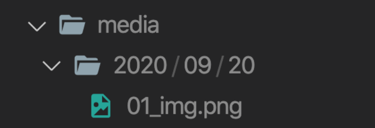

# 06_WorkShop

### 1.ImageField의 Optional Argument

- 사용자가 업로드한 파일들을 업로드 된 날짜에 따라 분류하고자 한다. 제시된 이미지와 같 이 저장 될 수 있도록 아래 링크를 참고하여 Media 파일 저장 경로를 설정하는 코드를 작성하시오.

  https://docs.python.org/3/library/time.html#time.strftime

  https://docs.djangoproject.com/en/3.1/ref/models/fields/#filefield

  

1. models.py에 image가 저장될 Field를 만든다.
   위 사진에 나온대로 년/월/일이 모두 나오도록 한다.

**models.py**

```python
class Article(models.Model):
    image = models.ImageField(
    	blank=True,
        upload_to="%Y/%m/%d/"
    )
```

2. model을 저렇게 형성하고 makemigrations를 하면,

```
Cannot use ImageField because Pillow is not installed.
```

위와 같은 에러를 띄울 것이다. Django에서 Imaging Library를 다루기 위해서는 Pillow를 설치해 주어야 한다.

```shell
$ pip install Pillow
```

2. image일 경우 form에 enctype="multipart/form-data" 태그를 만들어 주어야 한다.

**create.html**

```html
<form action="" method="POST" enctype="multipart/form-data"></form>
```

3. views.py에서 모델을 저장할 때 옵션을 살짝 바꿔 준다.

**settings.py**

4. ROOT, URL을 설정해 둔다.

```python
MEDIA_ROOT = BASE_DIR / 'media'
MEDIA_URL = '/media/'
```

5. urlpatterns에 경로를 추가해줘야 한다.
   static package를 사용해서, MEDIA_URL과 ROOT로 url path를 만들어 준다.

```python
from django.conf import settings
from django.conf.urls.static import static

urlpatterns = [
    path('admin/', admin.site.urls),
    path('articles/', include('articles.urls')),
] + static(settings.MEDIA_URL, document_root=settings.MEDIA_ROOT)
```
