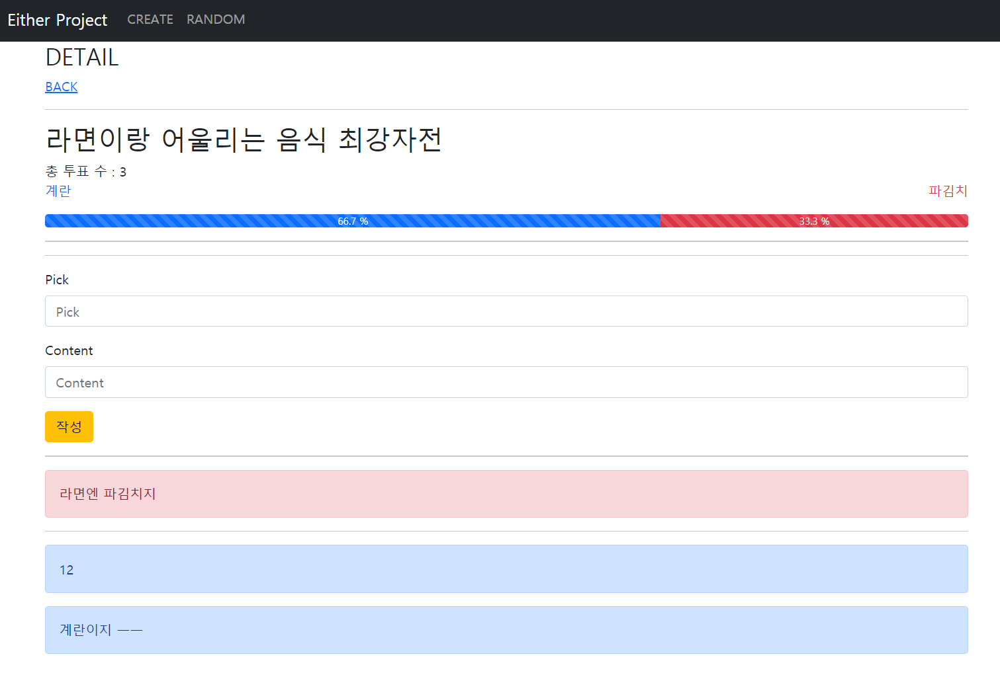

# 13_Workshop

## 투표 페이지 만들기



**views.py**

```python
from django.shortcuts import render, redirect, get_object_or_404
from .models import Vote, Comment
from .forms import VoteForm, CommentForm
from django.db.models import Count, Sum

# Create your views here.
def index(request):
    votes = Vote.objects.all()
    context = {
        'votes': votes,
    }
    return render(request, 'either/index.html', context)

def create(request):
    if request.method == 'POST':
        form = VoteForm(request.POST)
        if form.is_valid():
            vote = form.save()
            return redirect('either:detail', vote.pk)
    else:
        form = VoteForm()
    context = {
        'form': form,
    }
    return render(request, 'either/create.html', context)

def detail(request, vote_pk):
    vote = get_object_or_404(Vote, pk=vote_pk)
    comment_form = CommentForm()
    comments = vote.comments.all()
    total = len(vote.comments.all().annotate(Count('pick')))
    blue = round(comments.filter(pick='BLUE').count() / total * 100, 1)
    red = round(comments.filter(pick='RED').count() / total * 100, 1)
    context = {
        'vote': vote,
        'comments': comments,
        'comment_form': comment_form,
        'total': total,
        'blue': blue,
        'red': red,
    }
    return render(request, 'either/detail.html', context)

def create_comment(request, vote_pk):
    vote = get_object_or_404(Vote, pk=vote_pk)
    comment_form = CommentForm(request.POST)
    if request.method == 'POST':
        if comment_form.is_valid():
            comment = comment_form.save(commit=False)
            comment.vote = vote
            comment.save()
            return redirect('either:detail', vote.pk)
    context = {
        'comment_form': comment_form,
        'vote': vote,
    }
    return render(request, 'either/detail.html', context)

```

**models.py**

```python
from django.db import models

# Create your models here.
class Vote(models.Model):
    title = models.CharField(max_length=100)
    blue = models.CharField(max_length=50)
    red = models.CharField(max_length=50)

class Comment(models.Model):
    vote = models.ForeignKey(Vote, on_delete=models.CASCADE, related_name='comments')
    pick = models.CharField(max_length=5)
    content = models.CharField(max_length=50)

    def __str__(self):
        return self.content

```

**detail.html**

```html
  
<h3>DETAIL</h3>
<a href="">BACK</a>
<hr />
<!-- 투표현황 bar -->
<h2>{{ vote.title }}</h2>
총 투표 수 : {{ total }}
<div class="d-flex justify-content-between">
  <p class="text-primary">{{ vote.blue }}</p>
  <p class="text-danger">{{ vote.red }}</p>
</div>
<div class="progress">
  <div
    class="progress-bar progress-bar-striped progress-bar-animated"
    role="progressbar"
    aria-valuemin="0"
    aria-valuemax="100"
    style="width: {{ blue }}%"
  >
    {{ blue }} %
  </div>
  <div
    class="progress-bar progress-bar-striped progress-bar-animated bg-danger"
    role="progressbar"
    aria-valuemin="0"
    aria-valuemax="100"
    style="width: {{ red }}%"
  >
    {{ red }} %
  </div>
</div>

<hr />
<!-- 댓글작성 form -->
<hr />
<form action="" method="POST">
   
  <input type="submit" value="작성" class="btn btn-warning" />
</form>
<hr />
<!-- 댓글목록-->
  
<div class="alert alert-danger">{{ comment }}</div>
 
<hr />
 
<div class="alert alert-primary">{{ comment }}</div>
   
```
