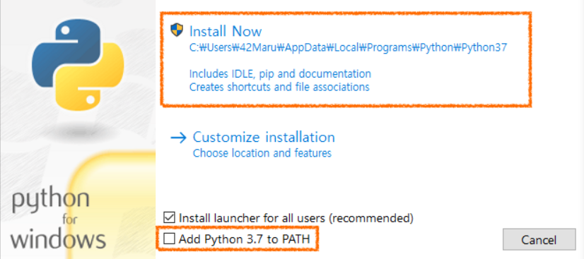
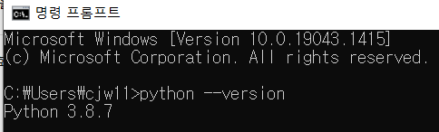
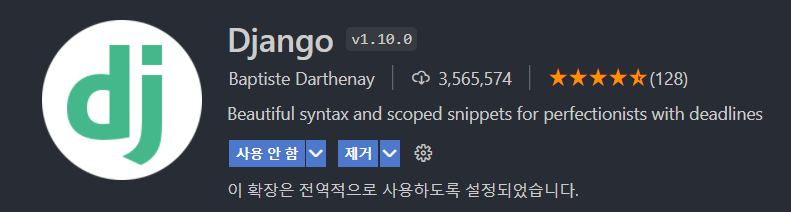
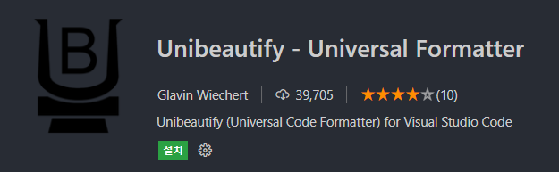
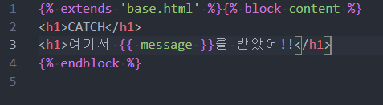
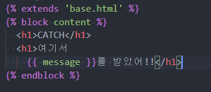

# Django Curriculum

## 시작하기 전에

### Python 설치

3.8.x 이상의 버전으로 설치. 이때, PATH에 추가하는 옵션을 체크해 주세요.



만일 체크하지 않으셨다면 `시스템 속성 > 환경 변수` 탭에서 추가해 주시면 됩니다.

shell 창에서 `python --version`을 입력했을 때, 아래와 같은 결과가 출력되어야 합니다.



### pip 설치

최신 버전으로 설치해 주세요.

### vscode django extension 설치



### prettier 설정

VScode에서 기본 제공되는 django html의 prettier는 매우 구립니다. `Unibeautify`를 설치해 주세요.



### django extension 설정

`ctrl + shift + p` -> `json 검색` -> `Preferences: Open Settings (JSON) 선택 후, 아래의 내용 추가해 주세요`

- vscode가 장고 템플릿을 django-html으로 인식하도록 설정하고, Unibeautify 플러그인이 formatting 하도록 설정해 줍시다.

 ```json
 // setting.json
 ...
 "files.associations": {
     "**/*.html": "html",
     "**/templates/**/*.html": "django-html",
     "**/templates/**/*": "django-txt",
     "**/requirements{/**,*}.{txt,in}": "pip-requirements",
 },
 "emmet.includeLanguages": {
     "django-html": "html",
 },
 "unibeautify.enabled": true,
 "[django-html]": {
   "editor.formatOnSave": true,
   "editor.defaultFormatter": "Glavin001.unibeautify-vscode"
 }
 ```

#### Prettier 설정 이전



#### Prettier 설정 이후

잘 저장되는 것을 볼 수 있습니다.



### 단축 커맨드 (alias) 설정 (Optional)

```json
// ~/.bashrc 혹은 ~/.zshrc... 사용하는 에디터의 세팅 파일에 아래의 내용 입력
alias makemigrations="python manage.py makemigrations"     
alias migrate="python manage.py migrate"
alias rundjango="python manage.py runserver"
alias makevenv="python -m venv venv"
alias runvenv="source venv/Scripts/activate"
```

### gitignore 설정

```

# Created by https://www.toptal.com/developers/gitignore/api/django,visualstudiocode
# Edit at https://www.toptal.com/developers/gitignore?templates=django,visualstudiocode

### Django ###
*.log
*.pot
*.pyc
__pycache__/
local_settings.py
db.sqlite3
db.sqlite3-journal
media

# If your build process includes running collectstatic, then you probably don't need or want to include staticfiles/
# in your Git repository. Update and uncomment the following line accordingly.
# <django-project-name>/staticfiles/

### Django.Python Stack ###
# Byte-compiled / optimized / DLL files
*.py[cod]
*$py.class

# C extensions
*.so

# Distribution / packaging
.Python
build/
develop-eggs/
dist/
downloads/
eggs/
.eggs/
lib/
lib64/
parts/
sdist/
var/
wheels/
share/python-wheels/
*.egg-info/
.installed.cfg
*.egg
MANIFEST

# PyInstaller
#  Usually these files are written by a python script from a template
#  before PyInstaller builds the exe, so as to inject date/other infos into it.
*.manifest
*.spec

# Installer logs
pip-log.txt
pip-delete-this-directory.txt

# Unit test / coverage reports
htmlcov/
.tox/
.nox/
.coverage
.coverage.*
.cache
nosetests.xml
coverage.xml
*.cover
*.py,cover
.hypothesis/
.pytest_cache/
cover/

# Translations
*.mo

# Django stuff:

# Flask stuff:
instance/
.webassets-cache

# Scrapy stuff:
.scrapy

# Sphinx documentation
docs/_build/

# PyBuilder
.pybuilder/
target/

# Jupyter Notebook
.ipynb_checkpoints

# IPython
profile_default/
ipython_config.py

# pyenv
#   For a library or package, you might want to ignore these files since the code is
#   intended to run in multiple environments; otherwise, check them in:
# .python-version

# pipenv
#   According to pypa/pipenv#598, it is recommended to include Pipfile.lock in version control.
#   However, in case of collaboration, if having platform-specific dependencies or dependencies
#   having no cross-platform support, pipenv may install dependencies that don't work, or not
#   install all needed dependencies.
#Pipfile.lock

# poetry
#   Similar to Pipfile.lock, it is generally recommended to include poetry.lock in version control.
#   This is especially recommended for binary packages to ensure reproducibility, and is more
#   commonly ignored for libraries.
#   https://python-poetry.org/docs/basic-usage/#commit-your-poetrylock-file-to-version-control
#poetry.lock

# PEP 582; used by e.g. github.com/David-OConnor/pyflow
__pypackages__/

# Celery stuff
celerybeat-schedule
celerybeat.pid

# SageMath parsed files
*.sage.py

# Environments
.env
.venv
env/
venv/
ENV/
env.bak/
venv.bak/

# Spyder project settings
.spyderproject
.spyproject

# Rope project settings
.ropeproject

# mkdocs documentation
/site

# mypy
.mypy_cache/
.dmypy.json
dmypy.json

# Pyre type checker
.pyre/

# pytype static type analyzer
.pytype/

# Cython debug symbols
cython_debug/

# PyCharm
#  JetBrains specific template is maintained in a separate JetBrains.gitignore that can
#  be found at https://github.com/github/gitignore/blob/main/Global/JetBrains.gitignore
#  and can be added to the global gitignore or merged into this file.  For a more nuclear
#  option (not recommended) you can uncomment the following to ignore the entire idea folder.
#.idea/

### VisualStudioCode ###
.vscode/*
!.vscode/settings.json
!.vscode/tasks.json
!.vscode/launch.json
!.vscode/extensions.json
!.vscode/*.code-snippets

# Local History for Visual Studio Code
.history/

# Built Visual Studio Code Extensions
*.vsix

### VisualStudioCode Patch ###
# Ignore all local history of files
.history
.ionide

# Support for Project snippet scope

# End of https://www.toptal.com/developers/gitignore/api/django,visualstudiocode
```

