# Django - model

[TOC]

## 목표

Model에 대해 학습하고, Model을 사용한 CRUD 실습

Database API 학습

## Django Model

장고에서 모델은 데이터를 구조화하고 조작하기 위한 도구입니다.

### Model

- 단일 데이터에 대한 정보를 가짐
  - 사용자가 저장하는 데이터들의 필수적인 필드들과 동작을 포함
- 저장된 DB의 구조(layout)
- django는 model을 통해 데이터에 접속하고 관리
- 일반적으로 하나의 model은 하나의 DB Table에 Mapping

### Database

- DB
  - 체계화된 데이터의 모임
- Query
  - 데이터를 조회하기 위한 명령어
  - 조건에 맞는 데이터를 추출하거나 조작하는 명령어

### Database의 기본 구조

- Schema
  - DB에서 자료의 구조, 표현방법, 관계 등을 정의한 구조
- Table
  - 필드 / 컬럼 / 속성 (열)
  - 레코드 / 행 / 튜플 (행)

### ORM

`Object-Relational-Mapping`은 객체지향 프로그래밍 언어를 사용하여 호환되지 않는 유형의 시스템 간에(Django - SQL) 데이터를 변환하는 프로그래밍 기술입니다. `가상 객체 DB`를 만들어 사용합니다.
Code에 SQL 쿼리를, DB에서 python 코드를 사용할 수 없으니, 그 중간에서 징검다리를 해 주는 ORM을 사용하게 되는 것입니다. 즉, ORM은 Python Object(객체)와 DB(관계형)를 매핑하는 기술입니다.

**우리는 DB를 객체(Object)로 조작하기 위해 ORM을 사용할 것입니다.**

### Migrations

모델 작성이 끝나면, Migration 작업을 해 줘야 합니다.

- django가 model에 생긴 변화(필드를 추가했다던가 모델을 삭제했다던가)를 반영하는 작업
- Migration 실행 및 DB 스키마를 다루기 위한 몇 가지 명령어
  - **makemigrations**
    - model을 변경한 것에 기반한 새로운 마이그레이션 (설계도)을 만들 때 사용
  - **migrate**
    - 마이그레이션(설계도)을 DB에 반영
    - 모델에서의 변경 사항들과 DB의 스키마를 동기화
    - 모델에서 만든 Class를 DB의 테이블과 동기화하여 실제로 DB에 저장/수정/삭제 될 수 있도록 함
  - sqlmigrate
    - 마이그레이션에 대한 SQL 구문을 보기 위해 사용
  - showmigrations
    - 프로젝트 전체의 마이그레이션 상태를 확인하기 위해 사용
    - 마이그레이션 파일들이 migrate 여부를 확인

**실습**

django의 Model 클래스를 상속받아 사용하겠습니다. [django github Model class](https://github.com/django/django/blob/4468bcc6579402904763ffa74b4ab0e41a1cd316/django/db/models/base.py#L476)

```
Article 모델을 생성하고, migration 해 보겠습니다.

python manage.py startapp articles -> settings에 추가

articles/models에 Article class를 models를 파라미터로 상속받아 선언합니다.
컬럼에 pk는 작성할 필요가 없습니다. 자동으로 입력됩니다!

모델을 만들었으면 설계도를 찍어냅니다.
python manage.py makemigrations
```


`migrations/0001_initial.py`가 ORM이 사용하는 설계도입니다.
저희는 이렇게 파이썬 코드로 작성하기만 하면 SQL을 사용하지 않아도 DB에 반영하게 되는 것입니다.

```
설계도를 DB에 적용합니다.
python manage.py migrate
```

이제 db.sqlite3를 우클릭해 Open Database를 누르면 DB의 테이블과 데이터를 확인할 수 있습니다. (vscode sqlite extension을 설치하고 진행합니다.)

```
마이그레이션의 SQL 문을 확인해 볼까요?
python manage.py sqlmigrate articles 0001

프로젝트의 마이그레이션 현황을 살펴볼까요?
python manage.py showmigrations
```

이후에도 모델을 수정했다면 makemigrations, migrate를 진행해 주면 되겠습니다. 그럼 Article 모델에 생성일, 수정일 컬럼을 추가해 보겠습니다.

```
서버에서 알아서 시간을 넣어 주도록 파라미터를 넣어줍니다.
created_at = models.DateTimeField(auto_now_add=True)
updated_at = models.DateTimeField(auto_now=True)
```

- auto_now: Automatically set the field to now every time the object is saved. Useful for 'last-modified' timestampls.
- auto_now_add: Automatically set the field to now when the object is first created. Useful for creation of timestampls.

그런데 makemigrations를 하는 순간, 아래와 같은 메시지를 보실 겁니다.

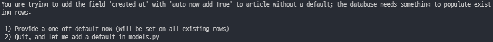

이는 기본값 없이 컬럼을 추가했기 때문입니다.
시간의 경우에는 저희가 직접 넣을 수 없기 때문에, 그냥 1번을 누르겠습니다.

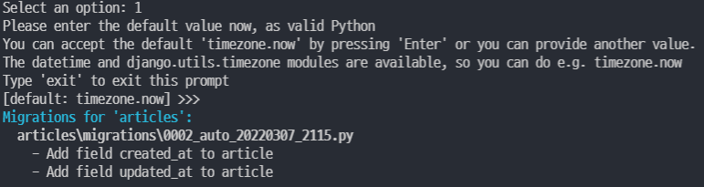

그러면 엔터를 눌렀을 때 timezone.now를 기본값으로 적용할 수 있다고 합니다. 굿! 자동으로 처리되고 새로운 설계도가 생성되었습니다. 설계도를 확인해 보면 deps에 0001 설계도가 들어 있고, 모든 컬럼을 새로 선언하는 것이 아니라 새로운 컬럼만 Add 하는 형태로 추가되었음을 알 수 있습니다. Git의 merge와 같습니다.

#### 반드시 기억해야 할 3단계

1. models.py
   - model 변경사항 발생
2. python manage.py makemigrations
   - migrations 파일 생성
3. python manage.py migrate
   - DB 적용

## Database API

### DB API

- DB를 조작하기 위한 도구
- django가 기본적으로 ORM을 제공함에 따른 것으로 DB를 편하게 조작할 수 있도록 도와줌
- Model을 만들면 django는 객체들을 만들고 읽고 수정하고 지울 수 있는 database-abstract API를 자동으로 만듦
- database-abstract API 혹은 database-access API라고 함

### DB API 구문 - Making Queries

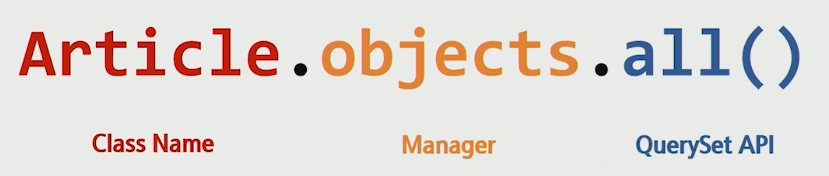

#### Manager

- django 모델에 DB query 작업이 제공되는 인터페이스
- 기본적으로 모든 django 모델 클래스에 `objects`라는 Manager 추가
  - 모델 클래스에는 메서드가 딱히 없음. DB를 조작하기 위한 명령어들을 Manager가 들고 있음

#### QuerySet

QuerySets 리턴, 단일 객체를 리턴 등 다양한 옵션을 확인하려면: [QuerySet API method docs](https://docs.djangoproject.com/en/4.0/ref/models/querysets/#)

- DB로부터 전달받은 객체 목록
- queryset 안의 객체는 0 ~ N개
- DB의 값을 그대로 혹은 filtering/sorting해서 가져올 수 있음

## CRUD

### CRUD by shell_plus

#### 준비

- django-extensions 설치
  - `pip install django-extensions`(하이픈)
- `INSTALLED_APPS`에 django_extensions(언더바) 추가

그리고 `python manage.py shell_plus`를 터미널에 입력하면 필요한 패키지를 자동으로 import해 온 편리한 shell이 실행됩니다.

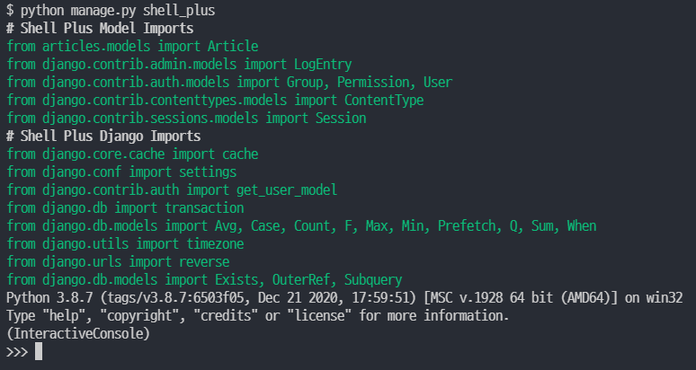

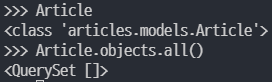

Article이라고 입력하면 class를 반환하고, 모든 객체를 가져오라는 all()에는 `<QuerySet []>`가 리턴되었습니다. []를 보면 짐작하실 수 있듯, Manager의 메소드가 리턴한 QuerySets는 리스트인 것 처럼 사용할 수 있습니다. for 반복문, 인덱싱, 슬라이싱 모두 가능합니다. 다만 리스트는 아닙니다.

#### model instance의 str 변경하기

article 인스턴스를 shell에 입력했을 때, 보이는 값을 변경하고 싶다면 아래와 같은 함수를 선언해 두면 됩니다.

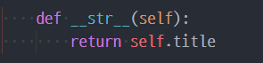

#### Create

##### save: 인스턴스를 생성한 뒤 저장하기

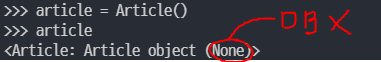

우선 article이라는 인스턴스를 하나 생성해 보겠습니다. 조회해 보면 None이라고 뜨네요. pk값이 없다는 뜻입니다. 이는 파이썬 단에 인스턴스로 존재할 뿐, DB에 동기화되지는 않은 상태이기 때문입니다.

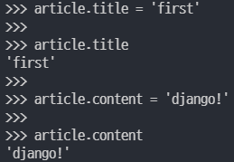

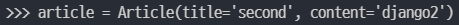

article의 title과 content를 입력해 주고 난 뒤에 `save()` 메소드로 저장하면, article의 pk값이 나타납니다.

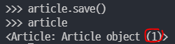

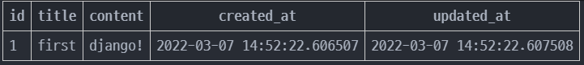

DB에 정상적으로 저장된 것을 볼 수 있습니다.

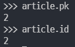

pk를 검색해 보면 잘 나옵니다. pk와 id 모두 동일한 값을 리턴하는데, 장고에서는 pk의 사용을 권장합니다.

이렇게 저희는 SQL문을 사용하지 않고, Python Object를 통해서 DB를 조작해 보았습니다.

##### create: 생성과 저장을 동시에! 단일 객체를 리턴하는 메소드

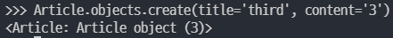

#### READ

- QuerySet API method를 사용한 다양한 조회를 하는 것이 중요

- `get()`: 단일 객체를 리턴

  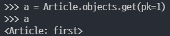

  - 객체가 없으면 DoesNotExist 에러 발생
  - 객체가 여러개일 경우 MultipleObjectsReturned 에러 발생
  - 위와 같은 특성을 가지기 때문에 unique, NOT NULL 특징을 가지고 있는 경우에만 인자로 사용할 것(pk)

- `all()`: querysets를 리턴

  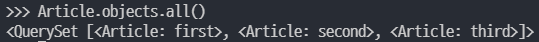

- `filter()`: 지정된 조건과 일치하는 모든 객체를 리턴

  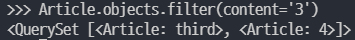

##### FIELD_LOOKUPS

- 조회 시 특정 조건을 적용시키기 위해 사용
- QuerySet method(get, filter, exclude)에 대한 키워드 인수로 사용됨

이건 맛만 보겠습니다. 자세한 것은 [Docs](https://docs.djangoproject.com/en/4.0/topics/db/queries/#field-lookups) 참조

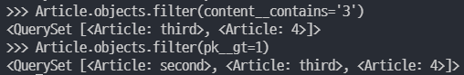

#### UPDATE

`get()` 메서드로 가져와서 수정할 수 있습니다.

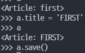

#### DELETE

`delete()` 메서드로 삭제가 가능합니다.

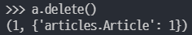

## Admin site

### Admin account 생성

`python manage.py createsuperuser`

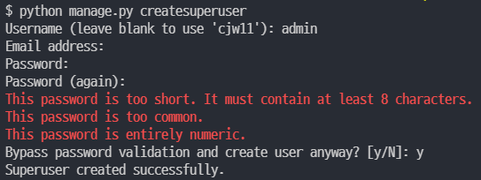

### Automatic admin interface

- 서버의 관리자가 활용하기 위한 페이지
- django.contrib.auth 모듈에서 제공
- record 생성 여부 확인에 매우 유용하며 직접 record를 삽입할 수도 있음

Article class를 admin.py에 등록하고 관리해 봅시다.

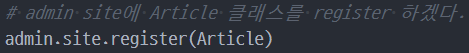

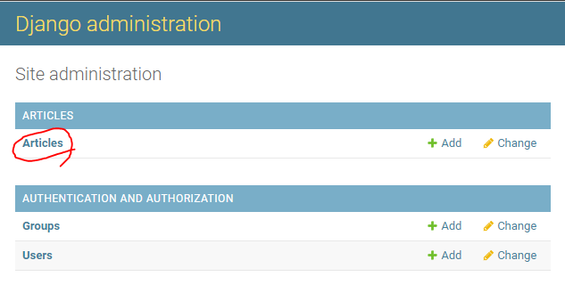

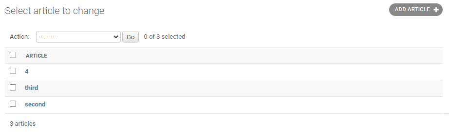

잘 보이네요. 여기서 정보를 수정하고, 새로운 인스턴스를 생성할 수도 있습니다.

그런데 보이는 정보가 너무 한정적이라고 생각되지 않으시나요? 사실 지금 이렇게 보이는 것도 모델에서 `__str__`을 설정해 두었기 때문입니다.

관리자 페이지에서 조금 더 자세한 정보를 확인하는 기능을 추가해 보겠습니다.

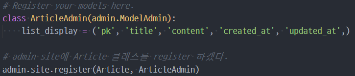

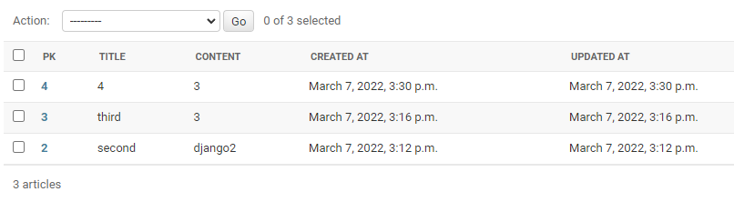

잘 보이네요!

### MTV로 READ 해보기

그럼 마지막으로 views.py를 사용해서 READ를 해 보겠습니다.

```
~/templates/base.html 생성
settings base 경로 추가
urls.py 생성, ~/.urls에 include

articles/url 설정, app_name 지정
views/def index
articles/templates/articles/index.html 생성

articles를 all()로 가져와서 for 반복문으로 출력하기
```
