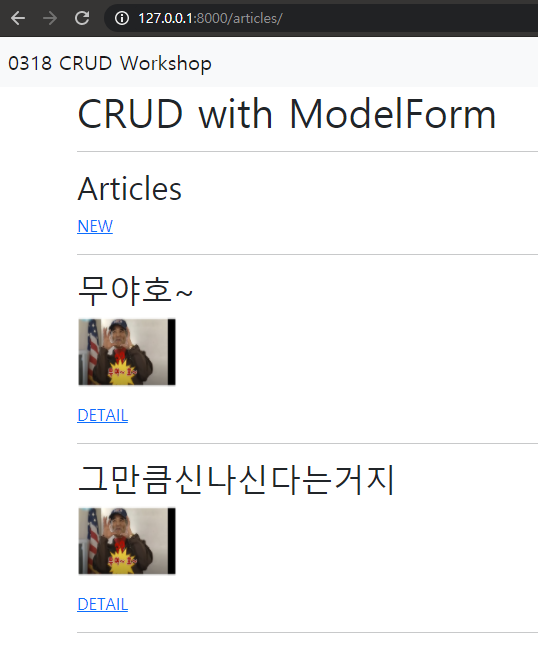
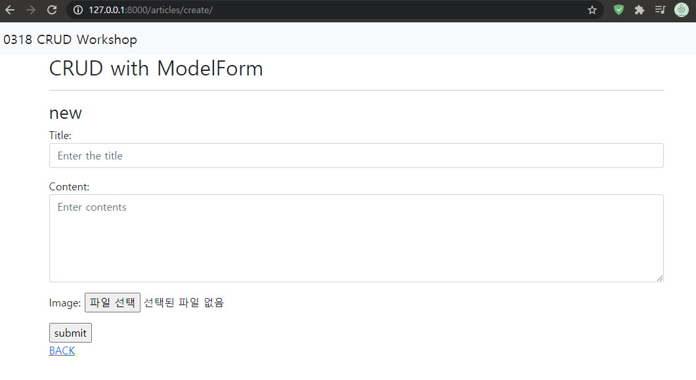
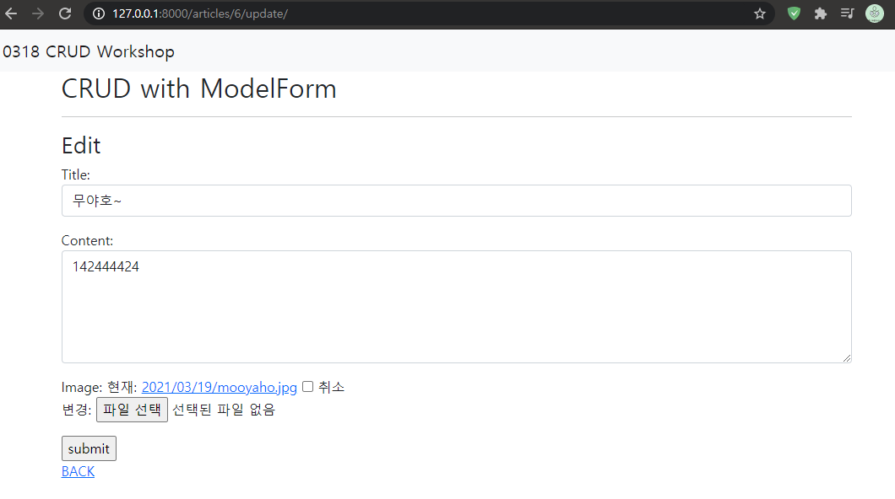

# 07_WorkShop

related project path : ssafy_mygit\django_hws\ModelForm_Practice

### ❖Django Project 

- Django Model Form을 활용해 CRUD를 모두 갖춘 장고 프로젝트를 제작하고 결과 사진과 코드를 별도의 마크다운 파일에 작성하여 제출하시오. 

  

### ❖ 기본 설정 

1) 프로젝트 이름은 crud, 앱 이름은 articles로 설정한다. 

2) 모든 템플릿에서 상속받아 사용할 base.html을 작성한다. base.html이 담긴 templates 디렉토리는 프로젝트 및 앱 디렉토리와 동일한 위치에 생성한다. base.html은 Bootstrap CDN을 포함하고 있어야 한다.


### ❖ CRUD 구현 제시된 결과 사진들을 참고하여 장고 프로젝트를 진행하시오. 

### 공통

**models.py**

배운게 아까워서 Image Field도 넣었습니다.

```python
from django.db import models

# Create your models here.
class Article(models.Model):
    title = models.CharField(max_length=10)
    content = models.TextField()
    image = models.ImageField(
        blank=True,
        upload_to="%Y/%m/%d/"
    )
    created_at = models.DateTimeField(auto_now_add=True)
    updated_at = models.DateTimeField(auto_now=True)
```

**forms.py**

ModelForm을 사용하면 create, update 과정에 일일이 적을 필요 없이 form.as_(p, ul, table) 옵션으로 퉁칠수 있습니다.

```python
from django import forms
from .models import Article

class ArticleForm(forms.ModelForm):
    title = forms.CharField(
        label='Title',
        widget=forms.TextInput(
            attrs={
                'class': 'my-title form-control',
                'placeholder': 'Enter the title',
                'maxlength': 10,
            }
        )
    )
    content = forms.CharField(
        label='Content',
        widget=forms.Textarea(
            attrs={
                'class': 'my-content form-control',
                'placeholder': 'Enter contents',
                'rows': 5,
                'cols': 30,
            }
        ),
        error_messages={
            'required': 'Can you plz enter the data..?',
        }
    )

    class Meta:
        model = Article
        fields = '__all__'

```


**base.html**

상속해서 써야 하는 base를 생성합니다.

Bootstrap CDN은 지금까지 계속 해 온 방법이기 때문에, django에서 제공하는 bootstrap5 패키지를 설치하고 불러와 사용합니다.

```shell
$ pip install django-bootstrap-v5
```

```html


<!DOCTYPE html>
<html lang="en">
<head>
  <meta charset="UTF-8">
  <meta http-equiv="X-UA-Compatible" content="IE=edge">
  <meta name="viewport" content="width=device-width, initial-scale=1.0">
  
  <title>Document</title>
</head>
<body>
  
  <div class="container">
    
    
  </div>
</body>
</html>
```

**nav.html**

```html
<nav class="navbar navbar-light bg-light">
  <div class="container-fluid">
    <span class="navbar-brand mb-0 h1">0318 CRUD Workshop</span>
  </div>
</nav>
```

1) Read



**index.html**

사진 파일을 업로드했을 경우 100 x 70의 작은 사진을 표시했습니다.

```html



  <h1>CRUD with ModelForm</h1>
  <hr>
  <h2>Articles</h2>
  <a href="">NEW</a>
  <hr>
  
    <h2>{{ article.hws_pk }}</h2>
    <h2>{{ article.title }}</h2>
    
      <p>
      
      </p>
    
    <a href="">DETAIL</a>
  <hr>
  

```

**views.py**

django decorator 모듈의 require 패키지를 사용합니다.

if 문으로 분기할 필요 없이, http method들을 제한할 수 있게 됩니다.

자바의 @override @Getter @Setter (or lombok..)이 생각났습니다.

```python
from django.shortcuts import render, redirect, get_object_or_404
from django.views.decorators.http import require_safe, require_POST, require_http_methods
from .models import Article
from .forms import ArticleForm


@require_safe
def index(request):
    articles = Article.objects.all()
    context = {
        'articles': articles,
    }
    return render(request, 'articles/index.html', context)
```


2) Create



**create.html**

```html



  <h2>CRUD with ModelForm</h2>
  <hr>
  <h3>new</h3>
    <form action="" method="POST" enctype="multipart/form-data">
      
      {{ form.as_p }}
      <input type="submit" value="submit">
    </form>
  <a href="">BACK</a>

```

**views.py**

```python
@require_http_methods(['GET', 'POST'])
def create(request):
    if request.method == 'POST':
        form = ArticleForm(request.POST, request.FILES)
        if form.is_valid():
            article = form.save()
            return redirect('articles:detail', article.pk)
    else:
        form = ArticleForm()
        context = {
            'form': form,
        }
        return render(request, 'articles/create.html', context)
```


3) Detail


**detail.html**

```html



  <h2>CRUD with ModelForm</h2>
  <hr>
  <h3>Detail</h3>
  <h3>글 번호: {{ article.pk }}</h3>
  <h3>글 제목: {{ article.title }}</h3>
  <p>글 내용: {{ article.content }}</p>
  <p>글 생성시각: {{ article.created_at }} </p>
  <p>글 수정시각: {{ article.updated_at }} </p>
  
  <p>
    
  </p>
  
  <a href="">EDIT</a>
  <form action="" method="POST">
    
    <input type="submit" value="DELETE">
  </form>
  <hr>
  <a href="">BACK</a>

```


**views.py**

```python
@require_safe
def detail(request, hws_pk):
    article = get_object_or_404(Article, pk=hws_pk)
    context = {
        'article': article,
    }
    return render(request, 'articles/detail.html', context)
```


4) Update



**update.html**

```html



  <h2>CRUD with ModelForm</h2>
  <hr>
  <h3>Edit</h3>
    <form action="" method="POST" enctype="multipart/form-data">
      
      {{ form.as_p }}
      <input type="submit" value="submit">
    </form>
  <a href="">BACK</a>

```

**views.py**

create와의 차이는 ModelForm으로 form 인스턴스를 만들 때, 기존의 article 인스턴스를 사용한다는 점입니다.

```python
@require_http_methods(['GET', 'POST'])
def update(request, hws_pk):
    article = get_object_or_404(Article, pk=hws_pk)

    if request.method == 'POST':
        form = ArticleForm(request.POST, request.FILES, instance=article)
        if form.is_valid():
            form.save()
            return redirect('articles:detail', article.pk)
    else:
        form = ArticleForm(instance=article)
    context = {
        'article': article,
        'form': form,
    }
    return render(request, 'articles/update.html', context)
```


5) Delete

```python
# Post일때만 가능하도록
@require_POST
def delete(request, hws_pk):
    article = get_object_or_404(Article, pk=hws_pk)
    article.delete()
    return redirect('articles:index')
```