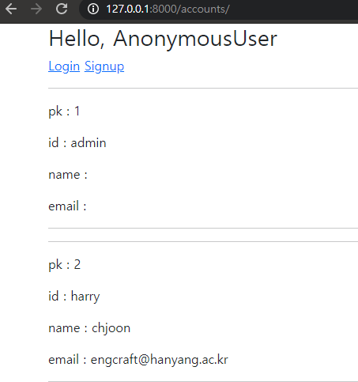
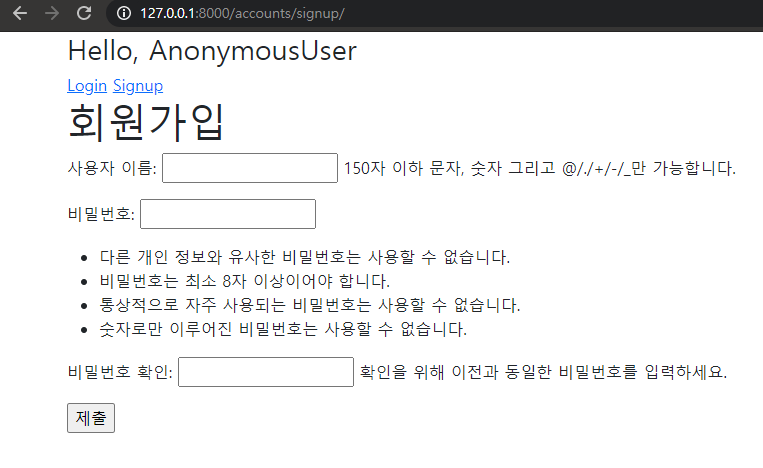

# 08_Workshop

## 1. /accounts/
유저 목록을 출력하는 페이지를 나타낸다.

### 풀이

model을 구성하고 DB에 저장하던 것과 달리, user를 새로 생성할 때는 UserCreationForm을 import 해서 사용했다.

하지만 결국 모델의 objects를 불러오는 것은 같다. user의 구성은 django.contrib.auth.models의 class User로 정의되어 있기 때문에, User class를 불러오면 되는 것이다.

**views.py**

```python
# (잘못된 코드) from django.contrib.auth.models import User
from django.contrib.auth import get_user_model
# 현재 활성화된 모델을 불러와야 하기 때문에 get_user_model을 사용해야 한다.
User = get_user_model()
@require_safe
def index(request):
    # User를 DB에 저장할 때 UserCreationForm을 사용한다.
    # 그럼 불러올 때는 어떻게 해야 할 것인가?
    # 모델을 불러와야 한다.

    users = User.objects.all()

    context = {
        'users': users,
    }
    return render(request, 'accounts/index.html', context)
```



## 2. /accounts/signup/
회원가입 작성을 위한 페이지를 나타낸다.
유저를 생성하는 기능을 수행한다.

**views.py**

```python
def signup(request):
    if request.method == 'POST':
        form = UserCreationForm(request.POST)
        if form.is_valid():
            user = form.save()
            auth_login(request, user) # for UX
            return redirect('articles:index')
    else:
        form = UserCreationForm()
    context = {
        'form': form,
    }
    return render(request, 'accounts/signup.html', context)
```



### 질문할 것

궁금한 것이 생겼습니다. Form과 ModelForm이 무슨 기준으로 나뉘어서 쓰이는지 궁금해졌습니다.

`UserCreationForm은 ModelForm이라서 request.POST 하나만 인자로 받습니다. 반면 AuthenticationForm은 Form이라서 form = AuthenticationForm(request, request.POST)의 형태로 받습니다.`

1. AuthenticationForm을 Form으로 받는 것은 UserCreationForm이 ModelForm을 사용하는 것과 무슨 차이가 있기 때문인지 궁금합니다. 둘 모두 method를 검사하고, POST로 정보를 받아오고, 후에 유효성도 검사하는 등 차이가 무엇인지 잘 모르겠습니다.
2. 위의 질문에 대해 찾아보다가 장고 깃허브에서 AuthenticationForm 함수`django.contrib.auth.forms - AuthenticationForm` 에서 초기화 함수를 살펴봤습니다. 여기서 request 를 받는 이유는 서브 클래스들에서 커스텀해서 사용할 경우를 위해서라고 나와 있는데,  UserChangeForm만 해도 커스텀해서 사용합니다.
```python
def __init__(self, request=None, *args, **kwargs):
        """
        The 'request' parameter is set for custom auth use by subclasses.
        The form data comes in via the standard 'data' kwarg.
        """
        self.request = request
        self.user_cache = None
```

3. 지금까지의 수업 내용에서 Form을 사용할 경우에는 유효성 검사 후 cleaned_data를 사용하고, model에 연관되지 않는 데이터를 추가로 받을 수 있다고 했는데, 혹시 인증 폼은 POST method로 값을 받아오는 동시에 추가로 데이터를 넣는 등의 커스텀을 하는 경우가 많아서 Form을 사용한 것일까요?
