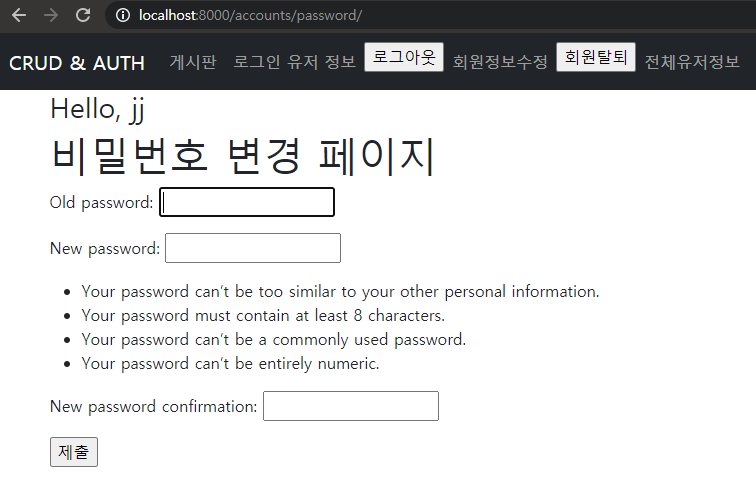

# 09_Workshop

# 1. User Change Password

 /accounts/password/ url을 가지며 유저의 비밀번호 수정 기능을 구현한다.



**views.py**

```python
@login_required
@require_http_methods(['GET', 'POST'])
def change_password(request):
    if request.method == 'POST':
        form = PasswordChangeForm(request.user, request.POST)
        if form.is_valid():
            form.save()
            update_session_auth_hash(request, form.user)
            return redirect('articles:index')
    else:
        # 여기서 자꾸 request를 받아와서 get Attribute 에러가 있었다!
        form = PasswordChangeForm(request.user)
    context = {
        'form': form,
    }
    return render(request, 'accounts/change_password.html', context)
```

