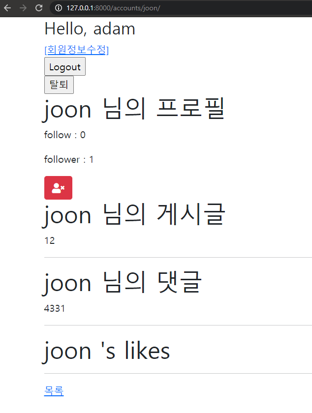

# 15_Workshop



**views.py**

```python
def profile(request, username):
    User = get_user_model()
    person = get_object_or_404(User, username=username)
    context = {
        'person': person,
    }
    return render(request, 'accounts/profile.html', context)

@require_POST
def follow(request, user_pk):
    if request.user.is_authenticated:
        User = get_user_model()
        you = get_object_or_404(User, pk=user_pk)
        me = request.user
        if you != me:
            if you.followers.filter(pk=me.pk).exists():
                you.followers.remove(me)
            else:
                you.followers.add(me)
        return redirect('accounts:profile', you.username)
    return redirect('accounts:login')

```


**models.py**

```python
class User(AbstractUser):
    followings = models.ManyToManyField('self', symmetrical=False, related_name="followers")

```


**profile.html**

```html



  <h1>{{ person.username }} 님의 프로필</h1>
  
    <p>follow : {{ followings|length }}</p>
    <p>follower : {{ followers|length }}</p>
    <form action="" method='POST'>
      
      
        
          <button class='btn btn-danger'><i class="fas fa-user-times"></i></button>
        
          <button class='btn btn-primary'><i class="fas fa-user-plus"></i></button>
        
      
    </form>
  

  <h1>{{ person.username }} 님의 게시글</h1>
  
    <div>{{ article.title }}</div>
  
  <hr>

  <h1>{{ person.username }} 님의 댓글</h1>
  
    <div>{{ comment.content }}</div>
  
  <hr>

  <h1>{{ person.username }} 's likes</h1>
    <ul>
    
        <li>{{ article.title }}</li>
    
    </ul>
  <hr>
  <a href="">목록</a>


```

